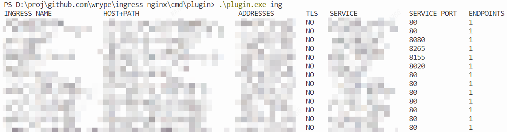
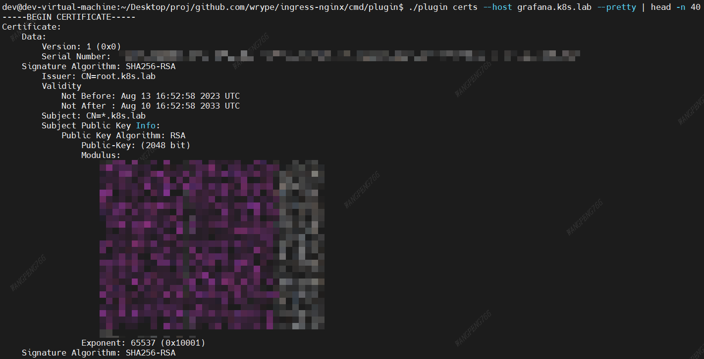
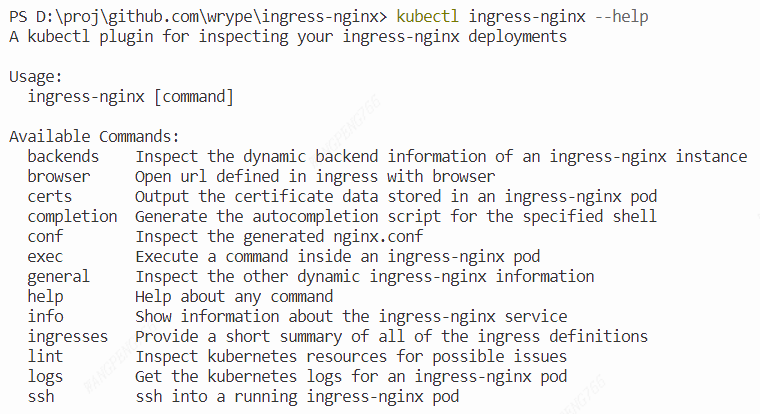

[简体中文](./README.md) | [English](./README_EN.md)

- [和上游ingress-nginx 插件的区别](#和上游ingress-nginx-插件的区别)
  - [去除`--container`默认值，提升兼容性](#去除--container默认值提升兼容性)
  - [添加`kubectl`常用的命令行参数简写](#添加kubectl常用的命令行参数简写)
  - [兼容旧版本的 k8s 集群](#兼容旧版本的-k8s-集群)
    - [集群版本 1.14](#集群版本-114)
    - [集群版本 1.18](#集群版本-118)
  - [优化查找 controller pod 的方法](#优化查找-controller-pod-的方法)
  - [`certs`子命令添加`--pretty`参数](#certs子命令添加--pretty参数)
  - [新增`browser`子命令，可以直接打开浏览器访问 ingress 定义的 url](#新增browser子命令可以直接打开浏览器访问-ingress-定义的-url)
- [怎么使用](#怎么使用)
- [PR](#pr)

## 和上游[ingress-nginx 插件](https://github.com/kubernetes/ingress-nginx/tree/main/cmd/plugin)的区别

基于上游代码修改，有以下几项区别：

### 去除`--container`默认值，提升兼容性

### 添加`kubectl`常用的命令行参数简写

### 兼容旧版本的 k8s 集群

上游的 ingress-nginx 插件只支持 1.19 以后的版本，这个分支可以兼容 1.19 以前的版本

> 1.14 版本部分兼容，无法统计`ingress`后端`endpoint`的数量

#### 集群版本 1.14


#### 集群版本 1.18



### 优化查找 controller pod 的方法

上游 ingress-nginx 插件查找 controller pod 需要`--deployment`等参数，这个分支的插件无需再指定任何参数

> 针对`backends`、`conf`等需要查找 controller pod 的子命令，指定`-n`（controller pod 所在的命名空间）参数性能会更好


### `certs`子命令添加`--pretty`参数

`certs`子命令会输出 PEM 证书链，指定`--pretty`参数后，会输出类似`openssl x509 -text`打印后方便阅读的格式（私钥会跳过）



### 新增`browser`子命令，可以直接打开浏览器访问 ingress 定义的 url


## 怎么使用

编译，然后将生成的`kubectl-ingress_nginx`二进制文件放到`PATH`环境变量可以访问的目录中

```bash
cd cmd/plugin
# windows
go build -o kubectl-ingress_nginx.exe .
# linux
go build -o kubectl-ingress_nginx .
```

`kubectl ingress-nginx --help`可以查看所有的子命令



想完整使用`browser`子命令的功能，需要下载[fzf](https://github.com/junegunn/fzf/releases)，同样也是将[fzf](https://github.com/junegunn/fzf/releases)二进制文件放到`PATH`环境变量可以访问的目录中

## PR

目前正在逐步提 PR 合并到上游代码，由于 PR 合并的过程较漫长，可以先使用这个分支的`ingress-nginx`插件

等到全部特性合并到上游代码后，这个分支将会废弃删除，到时候使用官方的插件即可

| PR 进度                             |                                                                  |        |
| ----------------------------------- | ---------------------------------------------------------------- | ------ |
| 去除`--container`默认值，提升兼容性 | [#10261](https://github.com/kubernetes/ingress-nginx/pull/10261) | 进行中 |
| 添加`kubectl`常用的命令行参数简写   | [#10261](https://github.com/kubernetes/ingress-nginx/pull/10261) | 进行中 |
| 兼容旧版本的 k8s 集群               |                                                                  | 下一步 |
| 优化查找 controller pod 的方法      |                                                                  |        |
| `certs`子命令添加`--pretty`参数     |                                                                  |        |
| 新增 browser 子命令                 |                                                                  |        |
