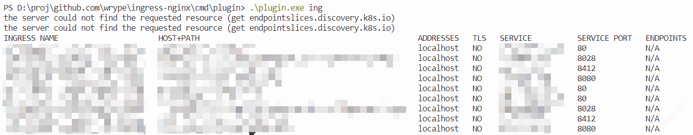
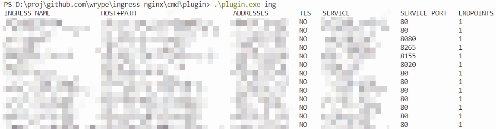
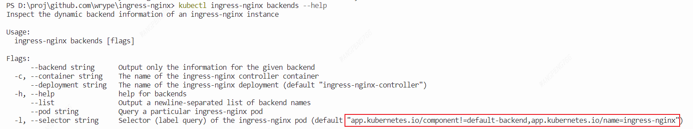
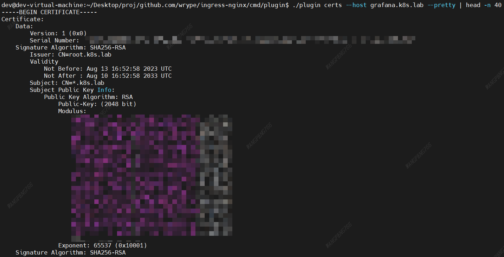
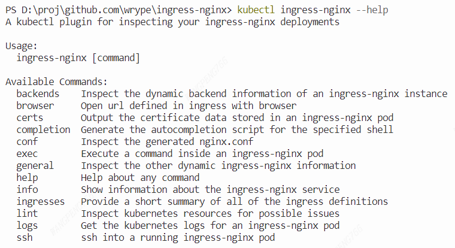

[简体中文](./README.md) | [English](./README_EN.md)

- [The difference with upstream ingress-nginx plugin](#the-difference-with-upstream-ingress-nginx-plugin)
  - [Remove the default value of `--container` arguement](#remove-the-default-value-of---container-arguement)
  - [Add some command line flags shorthand like `kubectl`](#add-some-command-line-flags-shorthand-like-kubectl)
  - [Compatible with old version k8s cluster](#compatible-with-old-version-k8s-cluster)
    - [cluster version 1.14](#cluster-version-114)
    - [cluster version 1.18](#cluster-version-118)
  - [Optimize the method of finding controller pods](#optimize-the-method-of-finding-controller-pods)
  - [Add `--pretty` arguement to `certs` subcommand](#add---pretty-arguement-to-certs-subcommand)
  - [Add a new `browser` subcommand, the url defined in ingress can be opened directly in web browser](#add-a-new-browser-subcommand-the-url-defined-in-ingress-can-be-opened-directly-in-web-browser)
- [How to use](#how-to-use)
- [PR](#pr)

## The difference with upstream [ingress-nginx plugin](https://github.com/kubernetes/ingress-nginx/tree/main/cmd/plugin)

Add some features base on upstream:

### Remove the default value of `--container` arguement

This can improve the compatibility.

### Add some command line flags shorthand like `kubectl`

### Compatible with old version k8s cluster

The ingress-nginx plugin in upstream only supports >= 1.19 version, the plugin in this branch can compatible with versions before 1.19.

> Partially compatible with 1.14 versions: unable to count the ingress's endpoints

#### cluster version 1.14



#### cluster version 1.18



### Optimize the method of finding controller pods

When using plugin in upstream to find controller pods, you should specify some argument, eg. `--deployment`.
But the plugin in this branch, you don't need to specify any arguement again.

> Especially using the subcommand need to find controller pods like `backends`, `conf`…… specify `-n` arguement (point to namespace of controller pods), the performance can be more better.



### Add `--pretty` arguement to `certs` subcommand

The `certs` subcommand can output PEM cert chain. When providing `--pretty` arguement, it will print the host certs in human readable format (private rsa key will skip), like the `openssl x509 -text` command.



### Add a new `browser` subcommand, the url defined in ingress can be opened directly in web browser


## How to use

Compile plugin，then move the `kubectl-ingress_nginx` executable to directory in env `$PATH`.

```bash
cd cmd/plugin
# windows
go build -o kubectl-ingress_nginx.exe .
# linux
go build -o kubectl-ingress_nginx .
```

`kubectl ingress-nginx --help` will show all subcommands.



If you want to use `browser` subcommand completely, download [fzf](https://github.com/junegunn/fzf/releases) tool, then move it to directory in env `$PATH`.

## PR

Now I gradually create PR to merge into upstream, but merging PR should take a long time. You can temporarily use plugin in this branch.

When all features have merged into upstream, this branch will be deleted, at that time, you just only use the plugin in upstream.

| PR processing                             |                                                                  |            |
| ----------------------------------------- | ---------------------------------------------------------------- | ---------- |
| remove default of `--container`           | [#10261](https://github.com/kubernetes/ingress-nginx/pull/10261) | Working    |
| add shorthand flags liki `kubectl`        | [#10261](https://github.com/kubernetes/ingress-nginx/pull/10261) | Working    |
| compatible with old version k8s           |                                                                  | Do it next |
| optimize method of finding controller pod |                                                                  |            |
| add `--pretty` flag to `certs` subcommand |                                                                  |            |
| add `browser` subcommand                  |                                                                  |            |
